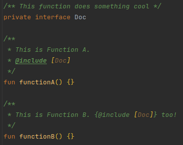
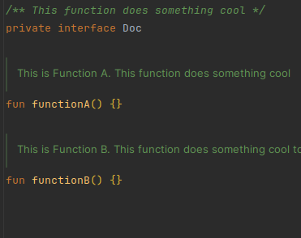

# KDoc Preprocessing

You might have spotted some notations like `{@include [Something]}` in the `/** KDocs */` of DataFrame's source code.
These are special notations for the [KDoc preprocessor](https://github.com/Jolanrensen/docProcessorGradlePlugin)
that we use to generate parts of the KDoc documentation.

Kotlin libraries like DataFrame use KDoc to document their code and especially their public API. This allows users
to understand how to use the library and what to expect from it. However, writing KDoc can be a tedious task, especially
when you have to repeat the same information in multiple places. The KDoc preprocessor allows us to write the
information
only once and then include it in multiple places.

This document explains how to use the KDoc preprocessor in the DataFrame project.

## How the Processing Works

Unlike Java, Kotlin library authors
[don't have the ability to share a jar file with documentation](https://github.com/Kotlin/dokka/issues/2787). They have
to share their documentation along with their `sources.jar` file which users can attach in their IDE to see the docs.
DataFrame thus uses the preprocessor in Gradle to copy and modify the source code, processing the KDoc notations,
and publishing the modified files as the `sources.jar` file.

This can be seen in action in the `core:processKDocsMain` and `core:changeJarTask` Gradle tasks in the
[core/build.gradle.kts file](core/build.gradle.kts). When you run any `publish` task in the `core` module, the
`processKDocsMain` task is executed first, which processes the KDocs in the source files and writes them to the
`generated-sources` folder. The `changeJarTask` task then makes sure that any `Jar` task in the `core` module uses the
`generated-sources` folder as the source directory instead of the normal `src` folder.

`core:processKDocsMain` can also be run separately if you just want to see the result of the KDoc processing.

To make sure the generated sources can be seen and reviewed on GitHub,
since [PR #731](https://github.com/Kotlin/dataframe/pull/731),
there's a [GitHub action](.github/workflows/generated-sources.yml) that runs the `core:processKDocsMain` task and
comments the results on the PR. After a PR is merged, [another action](.github/workflows/generated-sources-master.yml)
runs on the master branch and commits the generated sources automatically.
This way, the generated sources are always up-to-date with the latest changes in the code.
This means you don't have to run and commit the generated sources yourself, though it's
still okay if you do.

The processing by the KDoc preprocessor is done in multiple "waves" across the source files.
Each "wave" processes different notations and depends on the results of previous waves.
DataFrame uses
the [recommended order](https://github.com/Jolanrensen/docProcessorGradlePlugin/tree/main?tab=readme-ov-file#recommended-order-of-default-processors)
of processors, which is as follows:

- `INCLUDE_DOC_PROCESSOR`: The `@include` processor
- `INCLUDE_FILE_DOC_PROCESSOR`: The `@includeFile` processor
- `ARG_DOC_PROCESSOR`: The `@set` and `@get` / `$` processor. This runs `@set` first and then `@get` / `$`.
- `COMMENT_DOC_PROCESSOR`: The `@comment` processor
- `SAMPLE_DOC_PROCESSOR`: The `@sample` and `@sampleNoComments` processor
- `EXPORT_AS_HTML_DOC_PROCESSOR`: The `@exportAsHtmlStart` and `@exportAsHtmlEnd` tags for `@ExportAsHtml`
- `REMOVE_ESCAPE_CHARS_PROCESSOR`: The processor that removes escape characters

See the [Notation](#notation) section for more information on each of these processors.

## Previewing the Processed KDocs in IntelliJ IDEA

The preprocessor comes with an (experimental)
[IntelliJ IDEA plugin](https://github.com/Jolanrensen/docProcessorGradlePlugin?tab=readme-ov-file#intellij-plugin-alpha)
that allows you to preview the processed KDocs without having to run the Gradle task.


As described in the README of the preprocessor, the plugin may not 100% match the results of the Gradle task. This is
because it uses IntelliJ to resolve references instead of Dokka. However, it should give you a good idea of what the
processed KDocs will look like, and, most importantly, it's really fast.

You can install the plugin by building the project yourself or by downloading the latest release from the
[releases page](https://github.com/Jolanrensen/docProcessorGradlePlugin/releases).
Simply look for the latest release which has the zip file attached.
If it's outdated or doesn't work on your version of IntelliJ, don't hesitate to
ping [@Jolanrensen](https://github.com/Jolanrensen)
on GitHub. This also applies if you have any issues with the IntelliJ or Gradle plugin, of course :).

## Notation

The KDoc preprocessor uses special notations in the KDocs to indicate that a certain (tag) processor should be applied
in that place.
These notations follow the Javadoc/KDoc `@tag content`/`{@tag content}` tag notation.

Tags without `{}` are allowed, but only at the beginning of a line, like you're used to with
`@param`, `@return`, `@throws`, etc. If you want to use them in the middle of a line,
you should use `{}`.

Tag processors have access to any number of arguments they need, which are separated by spaces, like:
```kt
/**
 * @tag arg1 arg2 arg3 extra text
 * or {@tag arg1 arg2 arg3}
 */
```
though, most only need one or two arguments.
It's up to the tag processor what to do with excessive arguments, but most tag processors will leave them in place.

### `@include`: Including content from other KDocs

<p align="center">
  
&nbsp; &nbsp; &nbsp; &nbsp;
  
</p>

The most used tag across the library is `@include [Reference]`.
This tag includes all the content of the supplied reference's KDoc in the current KDoc.
The reference can be a class, function, property, or any other documented referable entity
(type aliases are an exception, as Dokka does not support them).
The reference can be a fully qualified name or a relative name; imports and aliases are taken into account.

You cannot include something from another library at the moment.

Writing something after the include tag, like

```kt
/**
 * @include [Reference] some text
 */
```

is allowed and will remain in place. Like:

```kt
/**
 * This is from the reference. some text
 */
```

Referencing a function with the same name as the current element is allowed and will be resolved correctly 
(although, the IntelliJ plugin will not resolve it correctly). 
The preprocessor assumes you don't want a circular reference, as that does not work for obvious reasons.

## KDoc Preprocessor Conventions in DataFrame

## KDoc -> WriterSide
